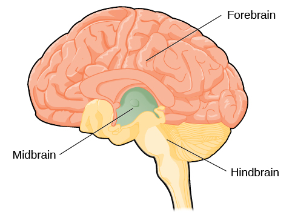
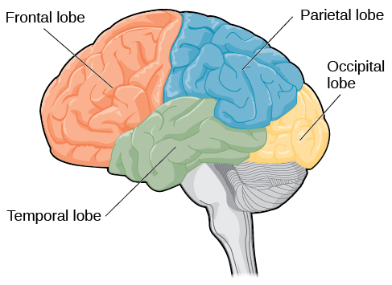
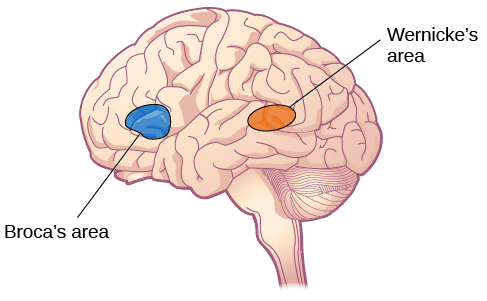
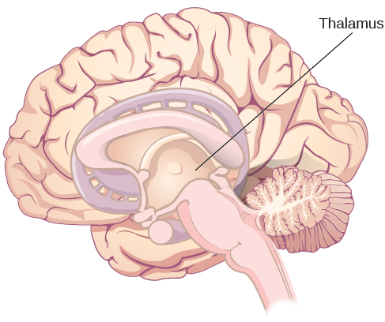
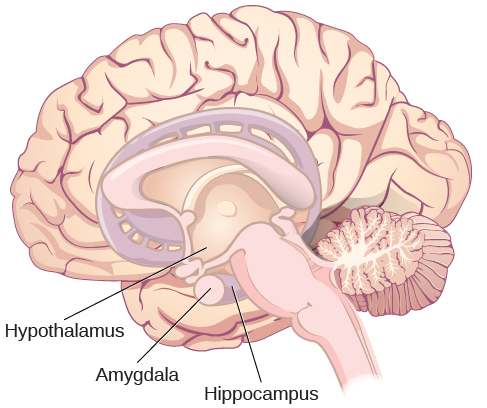
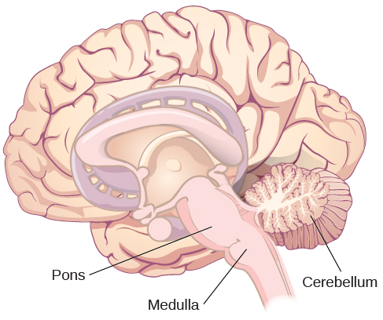

By the end of this section, you will be able to:
* Explain the functions of the spinal cord
* Identify the hemispheres and lobes of the brain
* Describe the types of techniques available to clinicians and researchers to image or scan the brain

The brain is a remarkably complex organ comprised of billions of interconnected neurons and glia. It is a bilateral, or two-sided, structure that can be separated into distinct lobes. Each lobe is associated with certain types of functions, but, ultimately, all of the areas of the brain interact with one another to provide the foundation for our thoughts and behaviors. In this section, we discuss the overall organization of the brain and the functions associated with different brain areas, beginning with what can be seen as an extension of the brain, the spinal cord.

### The Spinal Cord

It can be said that the **spinal cord**{: data-type="term" .no-emphasis} is what connects the brain to the outside world. Because of it, the brain can act. The spinal cord is like a relay station, but a very smart one. It not only routes messages to and from the brain, but it also has its own system of automatic processes, called reflexes.

The top of the spinal cord merges with the brain stem, where the basic processes of life are controlled, such as breathing and digestion. In the opposite direction, the spinal cord ends just below the ribs—contrary to what we might expect, it does not extend all the way to the base of the spine.

The spinal cord is functionally organized in 30 segments, corresponding with the vertebrae. Each segment is connected to a specific part of the body through the peripheral nervous system. Nerves branch out from the spine at each vertebra. Sensory nerves bring messages in; motor nerves send messages out to the muscles and organs. Messages travel to and from the brain through every segment.

Some sensory messages are immediately acted on by the spinal cord, without any input from the brain. Withdrawal from heat and knee jerk are two examples. When a sensory message meets certain parameters, the spinal cord initiates an automatic reflex. The signal passes from the sensory nerve to a simple processing center, which initiates a motor command. Seconds are saved, because messages don’t have to go the brain, be processed, and get sent back. In matters of survival, the spinal reflexes allow the body to react extraordinarily fast.

The spinal cord is protected by bony vertebrae and cushioned in cerebrospinal fluid, but injuries still occur. When the spinal cord is damaged in a particular segment, all lower segments are cut off from the brain, causing paralysis. Therefore, the lower on the spine damage is, the fewer functions an injured individual loses.

### The Two Hemispheres

The surface of the brain, known as the **cerebral cortex**{: data-type="term"}, is very uneven, characterized by a distinctive pattern of folds or bumps, known as **gyri**{: data-type="term"} (singular: gyrus), and grooves, known as **sulci**{: data-type="term"} (singular: sulcus), shown in [\[link\]](#CNX_Psych_03_04_Cortex). These gyri and sulci form important landmarks that allow us to separate the brain into functional centers. The most prominent sulcus, known as the **longitudinal fissure**{: data-type="term"}, is the deep groove that separates the brain into two halves or **hemispheres**{: data-type="term"}\: the left hemisphere and the right hemisphere.

 "){: #CNX_Psych_03_04_Cortex}

There is evidence of some specialization of function—referred to as **lateralization**{: data-type="term"}—in each hemisphere, mainly regarding differences in language ability. Beyond that, however, the differences that have been found have been minor. What we do know is that the left hemisphere controls the right half of the body, and the right hemisphere controls the left half of the body.

The two hemispheres are connected by a thick band of neural fibers known as the **corpus callosum**{: data-type="term"}, consisting of about 200 million axons. The corpus callosum allows the two hemispheres to communicate with each other and allows for information being processed on one side of the brain to be shared with the other side.

Normally, we are not aware of the different roles that our two hemispheres play in day-to-day functions, but there are people who come to know the capabilities and functions of their two hemispheres quite well. In some cases of severe epilepsy, doctors elect to sever the corpus callosum as a means of controlling the spread of seizures ([\[link\]](#CNX_Psych_03_04_CorpusCall)). While this is an effective treatment option, it results in individuals who have split brains. After surgery, these split-brain patients show a variety of interesting behaviors. For instance, a split-brain patient is unable to name a picture that is shown in the patient’s left visual field because the information is only available in the largely nonverbal right hemisphere. However, they are able to recreate the picture with their left hand, which is also controlled by the right hemisphere. When the more verbal left hemisphere sees the picture that the hand drew, the patient is able to name it (assuming the left hemisphere can interpret what was drawn by the left hand).

  The corpus callosum connects the left and right hemispheres of the brain. (c) A scientist spreads this dissected sheep brain apart to show the corpus callosum between the hemispheres. (credit c: modification of work by Aaron Bornstein)"){: #CNX_Psych_03_04_CorpusCall}

  
This [interactive animation][1] on the Nobel Prize website walks users through the hemispheres of the brain.

Much of what we know about the functions of different areas of the brain comes from studying changes in the behavior and ability of individuals who have suffered damage to the brain. For example, researchers study the behavioral changes caused by strokes to learn about the functions of specific brain areas. A stroke, caused by an interruption of blood flow to a region in the brain, causes a loss of brain function in the affected region. The damage can be in a small area, and, if it is, this gives researchers the opportunity to link any resulting behavioral changes to a specific area. The types of deficits displayed after a stroke will be largely dependent on where in the brain the damage occurred.

Consider Theona, an intelligent, self-sufficient woman, who is 62 years old. Recently, she suffered a stroke in the front portion of her right hemisphere. As a result, she has great difficulty moving her left leg. (As you learned earlier, the right hemisphere controls the left side of the body; also, the brain’s main motor centers are located at the front of the head, in the frontal lobe.) Theona has also experienced behavioral changes. For example, while in the produce section of the grocery store, she sometimes eats grapes, strawberries, and apples directly from their bins before paying for them. This behavior—which would have been very embarrassing to her before the stroke—is consistent with damage in another region in the frontal lobe—the prefrontal cortex, which is associated with judgment, reasoning, and impulse control.

### Forebrain Structures

The two hemispheres of the cerebral cortex are part of the **forebrain**{: data-type="term"} ([\[link\]](#CNX_Psych_03_04_FMHBrain)), which is the largest part of the brain. The forebrain contains the cerebral cortex and a number of other structures that lie beneath the cortex (called subcortical structures): thalamus, hypothalamus, pituitary gland, and the limbic system (collection of structures). The cerebral cortex, which is the outer surface of the brain, is associated with higher level processes such as consciousness, thought, emotion, reasoning, language, and memory. Each cerebral hemisphere can be subdivided into four lobes, each associated with different functions.

{: #CNX_Psych_03_04_FMHBrain}

#### Lobes of the Brain

The four lobes of the brain are the frontal, parietal, temporal, and occipital lobes ([\[link\]](#CNX_Psych_03_04_Lobes)). The **frontal lobe**{: data-type="term"} is located in the forward part of the brain, extending back to a fissure known as the central sulcus. The frontal lobe is involved in reasoning, motor control, emotion, and language. It contains the **motor cortex**{: data-type="term"}, which is involved in planning and coordinating movement; the **prefrontal cortex**{: data-type="term"}, which is responsible for higher-level cognitive functioning; and **Broca’s area**{: data-type="term"}, which is essential for language production.

 {: #CNX_Psych_03_04_Lobes}

People who suffer damage to Broca’s area have great difficulty producing language of any form ([\[link\]](#CNX_Psych_03_04_Lobes)). For example, Padma was an electrical engineer who was socially active and a caring, involved mother. About twenty years ago, she was in a car accident and suffered damage to her Broca’s area. She completely lost the ability to speak and form any kind of meaningful language. There is nothing wrong with her mouth or her vocal cords, but she is unable to produce words. She can follow directions but can’t respond verbally, and she can read but no longer write. She can do routine tasks like running to the market to buy milk, but she could not communicate verbally if a situation called for it.

Probably the most famous case of frontal lobe damage is that of a man by the name of Phineas **Gage**{: data-type="term" .no-emphasis}. On September 13, 1848, Gage (age 25) was working as a railroad foreman in Vermont. He and his crew were using an iron rod to tamp explosives down into a blasting hole to remove rock along the railway’s path. Unfortunately, the iron rod created a spark and caused the rod to explode out of the blasting hole, into Gage’s face, and through his skull ([\[link\]](#CNX_Psych_03_04_GageSkull)). Although lying in a pool of his own blood with brain matter emerging from his head, Gage was conscious and able to get up, walk, and speak. But in the months following his accident, people noticed that his personality had changed. Many of his friends described him as no longer being himself. Before the accident, it was said that Gage was a well-mannered, soft-spoken man, but he began to behave in odd and inappropriate ways after the accident. Such changes in personality would be consistent with loss of impulse control—a frontal lobe function.

Beyond the damage to the frontal lobe itself, subsequent investigations into the rod\'s path also identified probable damage to pathways between the frontal lobe and other brain structures, including the limbic system. With connections between the planning functions of the frontal lobe and the emotional processes of the limbic system severed, Gage had difficulty controlling his emotional impulses.

However, there is some evidence suggesting that the dramatic changes in Gage’s personality were exaggerated and embellished. Gage\'s case occurred in the midst of a 19th century debate over localization—regarding whether certain areas of the brain are associated with particular functions. On the basis of extremely limited information about Gage, the extent of his injury, and his life before and after the accident, scientists tended to find support for their own views, on whichever side of the debate they fell (Macmillan, 1999).

 Phineas Gage holds the iron rod that penetrated his skull in an 1848 railroad construction accident. (b) Gage&#x2019;s prefrontal cortex was severely damaged in the left hemisphere. The rod entered Gage&#x2019;s face on the left side, passed behind his eye, and exited through the top of his skull, before landing about 80 feet away. (credit a: modification of work by Jack and Beverly Wilgus)"){: #CNX_Psych_03_04_GageSkull}

The brain’s **parietal lobe**{: data-type="term"} is located immediately behind the frontal lobe, and is involved in processing information from the body’s senses. It contains the **somatosensory cortex**{: data-type="term"}, which is essential for processing sensory information from across the body, such as touch, temperature, and pain. The somatosensory cortex is organized topographically, which means that spatial relationships that exist in the body are maintained on the surface of the somatosensory cortex ([\[link\]](#CNX_Psych_03_04_BrainOrg)). For example, the portion of the cortex that processes sensory information from the hand is adjacent to the portion that processes information from the wrist.

 {: #CNX_Psych_03_04_BrainOrg}

The **temporal lobe**{: data-type="term"} is located on the side of the head (temporal means “near the temples”), and is associated with hearing, memory, emotion, and some aspects of language. The **auditory cortex**{: data-type="term"}, the main area responsible for processing auditory information, is located within the temporal lobe. **Wernicke’s area**{: data-type="term"}, important for speech comprehension, is also located here. Whereas individuals with damage to Broca’s area have difficulty producing language, those with damage to Wernicke’s area can produce sensible language, but they are unable to understand it ([\[link\]](#CNX_Psych_03_04_Broca)).

 {: #CNX_Psych_03_04_Broca}

The **occipital lobe**{: data-type="term"} is located at the very back of the brain, and contains the primary visual cortex, which is responsible for interpreting incoming visual information. The occipital cortex is organized retinotopically, which means there is a close relationship between the position of an object in a person’s visual field and the position of that object’s representation on the cortex. You will learn much more about how visual information is processed in the occipital lobe when you study sensation and perception.

#### Other Areas of the Forebrain

Other areas of the **forebrain**{: data-type="term" .no-emphasis}, located beneath the cerebral cortex, include the thalamus and the limbic system. The **thalamus**{: data-type="term"} is a sensory relay for the brain. All of our senses, with the exception of smell, are routed through the thalamus before being directed to other areas of the brain for processing ([\[link\]](#CNX_Psych_03_04_Thalamus)).

 {: #CNX_Psych_03_04_Thalamus}

The **limbic system**{: data-type="term"} is involved in processing both emotion and memory. Interestingly, the sense of smell projects directly to the limbic system; therefore, not surprisingly, smell can evoke emotional responses in ways that other sensory modalities cannot. The limbic system is made up of a number of different structures, but three of the most important are the hippocampus, the amygdala, and the hypothalamus ([\[link\]](#CNX_Psych_03_04_Limbic)). The **hippocampus**{: data-type="term"} is an essential structure for learning and memory. The **amygdala**{: data-type="term"} is involved in our experience of emotion and in tying emotional meaning to our memories. The **hypothalamus**{: data-type="term"} regulates a number of homeostatic processes, including the regulation of body temperature, appetite, and blood pressure. The hypothalamus also serves as an interface between the nervous system and the endocrine system and in the regulation of sexual motivation and behavior.

 {: #CNX_Psych_03_04_Limbic}

#### The Case of Henry Molaison (H.M.)

In 1953, Henry Gustav **Molaison**{: data-type="term" .no-emphasis} (H. M.) was a 27-year-old man who experienced severe seizures. In an attempt to control his seizures, H. M. underwent brain surgery to remove his hippocampus and amygdala. Following the surgery, H.M’s seizures became much less severe, but he also suffered some unexpected—and devastating—consequences of the surgery: he lost his ability to form many types of new memories. For example, he was unable to learn new facts, such as who was president of the United States. He was able to learn new skills, but afterward he had no recollection of learning them. For example, while he might learn to use a computer, he would have no conscious memory of ever having used one. He could not remember new faces, and he was unable to remember events, even immediately after they occurred. Researchers were fascinated by his experience, and he is considered one of the most studied cases in medical and psychological history (Hardt, Einarsson, &amp; Nader, 2010; Squire, 2009). Indeed, his case has provided tremendous insight into the role that the hippocampus plays in the consolidation of new learning into explicit memory.

  
Clive Wearing, an accomplished musician, lost the ability to form new memories when his hippocampus was damaged through illness. Check out the first few minutes of this [documentary video][2] for an introduction to this man and his condition.

### Midbrain and Hindbrain Structures

The **midbrain**{: data-type="term"} is comprised of structures located deep within the brain, between the forebrain and the hindbrain. The **reticular formation**{: data-type="term"} is centered in the midbrain, but it actually extends up into the forebrain and down into the hindbrain. The reticular formation is important in regulating the sleep/wake cycle, arousal, alertness, and motor activity.

The **substantia nigra**{: data-type="term"} (Latin for “black substance”) and the **ventral tegmental area (VTA)**{: data-type="term"} are also located in the midbrain ([\[link\]](#CNX_Psych_03_04_Midbrain)). Both regions contain cell bodies that produce the neurotransmitter dopamine, and both are critical for movement. Degeneration of the substantia nigra and VTA is involved in Parkinson’s disease. In addition, these structures are involved in mood, reward, and addiction (Berridge &amp; Robinson, 1998; Gardner, 2011; George, Le Moal, &amp; Koob, 2012).

 are located in the midbrain."){: #CNX_Psych_03_04_Midbrain}

The **hindbrain**{: data-type="term"} is located at the back of the head and looks like an extension of the spinal cord. It contains the medulla, pons, and cerebellum ([\[link\]](#CNX_Psych_03_04_Hindbrain)). The **medulla**{: data-type="term"} controls the automatic processes of the autonomic nervous system, such as breathing, blood pressure, and heart rate. The word pons literally means “bridge,” and as the name suggests, the **pons**{: data-type="term"} serves to connect the brain and spinal cord. It also is involved in regulating brain activity during sleep. The medulla, pons, and midbrain together are known as the brainstem.

{: #CNX_Psych_03_04_Hindbrain}

The **cerebellum**{: data-type="term"} (Latin for “little brain”) receives messages from muscles, tendons, joints, and structures in our ear to control balance, coordination, movement, and motor skills. The cerebellum is also thought to be an important area for processing some types of memories. In particular, procedural memory, or memory involved in learning and remembering how to perform tasks, is thought to be associated with the cerebellum. Recall that H. M. was unable to form new explicit memories, but he could learn new tasks. This is likely due to the fact that H. M.’s cerebellum remained intact.

Brain Dead and on Life Support

What would you do if your spouse or loved one was declared brain dead but his or her body was being kept alive by medical equipment? Whose decision should it be to remove a feeding tube? Should medical care costs be a factor?

On February 25, 1990, a Florida woman named Terri **Schiavo**{: data-type="term" .no-emphasis} went into cardiac arrest, apparently triggered by a bulimic episode. She was eventually revived, but her brain had been deprived of oxygen for a long time. Brain scans indicated that there was no activity in her cerebral cortex, and she suffered from severe and permanent cerebral atrophy. Basically, Schiavo was in a vegetative state. Medical professionals determined that she would never again be able to move, talk, or respond in any way. To remain alive, she required a feeding tube, and there was no chance that her situation would ever improve.

On occasion, Schiavo’s eyes would move, and sometimes she would groan. Despite the doctors’ insistence to the contrary, her parents believed that these were signs that she was trying to communicate with them.

After 12 years, Schiavo’s husband argued that his wife would not have wanted to be kept alive with no feelings, sensations, or brain activity. Her parents, however, were very much against removing her feeding tube. Eventually, the case made its way to the courts, both in the state of Florida and at the federal level. By 2005, the courts found in favor of Schiavo’s husband, and the feeding tube was removed on March 18, 2005. Schiavo died 13 days later.

Why did Schiavo’s eyes sometimes move, and why did she groan? Although the parts of her brain that control thought, voluntary movement, and feeling were completely damaged, her brainstem was still intact. Her medulla and pons maintained her breathing and caused involuntary movements of her eyes and the occasional groans. Over the 15-year period that she was on a feeding tube, Schiavo’s medical costs may have topped $7 million (Arnst, 2003).

These questions were brought to popular conscience 25 years ago in the case of Terri Schiavo, and they persist today. In 2013, a 13-year-old girl who suffered complications after tonsil surgery was declared brain dead. There was a battle between her family, who wanted her to remain on life support, and the hospital’s policies regarding persons declared brain dead. In another complicated 2013–14 case in Texas, a pregnant EMT professional declared brain dead was kept alive for weeks, despite her spouse’s directives, which were based on her wishes should this situation arise. In this case, state laws designed to protect an unborn fetus came into consideration until doctors determined the fetus unviable.

Decisions surrounding the medical response to patients declared brain dead are complex. What do you think about these issues?

### Brain Imaging

You have learned how brain injury can provide information about the functions of different parts of the brain. Increasingly, however, we are able to obtain that information using **brain imaging**{: data-type="term" .no-emphasis} techniques on individuals who have not suffered brain injury. In this section, we take a more in-depth look at some of the techniques that are available for imaging the brain, including techniques that rely on radiation, magnetic fields, or electrical activity within the brain.

#### Techniques Involving Radiation

A **computerized tomography (CT) scan**{: data-type="term"} involves taking a number of x-rays of a particular section of a person’s body or brain ([\[link\]](#CNX_Psych_03_04_CT)). The x-rays pass through tissues of different densities at different rates, allowing a computer to construct an overall image of the area of the body being scanned. A CT scan is often used to determine whether someone has a tumor, or significant brain atrophy.

  The image on the left shows a healthy brain, whereas (b) the image on the right indicates a brain tumor in the left frontal lobe. (credit a: modification of work by &quot;Aceofhearts1968&quot;/Wikimedia Commons; credit b: modification of work by Roland Schmitt et al)&#10;"){: #CNX_Psych_03_04_CT}

**Positron emission tomography (PET)**{: data-type="term"} scans create pictures of the living, active brain ([\[link\]](#CNX_Psych_03_04_PET)). An individual receiving a PET scan drinks or is injected with a mildly radioactive substance, called a tracer. Once in the bloodstream, the amount of tracer in any given region of the brain can be monitored. As brain areas become more active, more blood flows to that area. A computer monitors the movement of the tracer and creates a rough map of active and inactive areas of the brain during a given behavior. PET scans show little detail, are unable to pinpoint events precisely in time, and require that the brain be exposed to radiation; therefore, this technique has been replaced by the fMRI as an alternative diagnostic tool. However, combined with CT, PET technology is still being used in certain contexts. For example, CT/PET scans allow better imaging of the activity of neurotransmitter receptors and open new avenues in schizophrenia research. In this hybrid CT/PET technology, CT contributes clear images of brain structures, while PET shows the brain’s activity.

"){: #CNX_Psych_03_04_PET}

#### Techniques Involving Magnetic Fields

In **magnetic resonance imaging (MRI)**{: data-type="term"}, a person is placed inside a machine that generates a strong magnetic field. The magnetic field causes the hydrogen atoms in the body’s cells to move. When the magnetic field is turned off, the hydrogen atoms emit electromagnetic signals as they return to their original positions. Tissues of different densities give off different signals, which a computer interprets and displays on a monitor. **Functional magnetic resonance imaging (fMRI)**{: data-type="term"} operates on the same principles, but it shows changes in brain activity over time by tracking blood flow and oxygen levels. The fMRI provides more detailed images of the brain’s structure, as well as better accuracy in time, than is possible in PET scans ([\[link\]](#CNX_Psych_03_04_fMRI)). With their high level of detail, MRI and fMRI are often used to compare the brains of healthy individuals to the brains of individuals diagnosed with psychological disorders. This comparison helps determine what structural and functional differences exist between these populations.

"){: #CNX_Psych_03_04_fMRI}

  
Visit this [virtual lab][3] to learn more about MRI and fMRI.

#### Techniques Involving Electrical Activity

In some situations, it is helpful to gain an understanding of the overall activity of a person’s brain, without needing information on the actual location of the activity. **Electroencephalography (EEG)**{: data-type="term"} serves this purpose by providing a measure of a brain’s electrical activity. An array of electrodes is placed around a person’s head ([\[link\]](#CNX_Psych_03_04_EEG)). The signals received by the electrodes result in a printout of the electrical activity of his or her brain, or brainwaves, showing both the frequency (number of waves per second) and amplitude (height) of the recorded brainwaves, with an accuracy within milliseconds. Such information is especially helpful to researchers studying sleep patterns among individuals with sleep disorders.

 "){: #CNX_Psych_03_04_EEG}

### Summary

The brain consists of two hemispheres, each controlling the opposite side of the body. Each hemisphere can be subdivided into different lobes: frontal, parietal, temporal, and occipital. In addition to the lobes of the cerebral cortex, the forebrain includes the thalamus (sensory relay) and limbic system (emotion and memory circuit). The midbrain contains the reticular formation, which is important for sleep and arousal, as well as the substantia nigra and ventral tegmental area. These structures are important for movement, reward, and addictive processes. The hindbrain contains the structures of the brainstem (medulla, pons, and midbrain), which control automatic functions like breathing and blood pressure. The hindbrain also contains the cerebellum, which helps coordinate movement and certain types of memories.

Individuals with brain damage have been studied extensively to provide information about the role of different areas of the brain, and recent advances in technology allow us to glean similar information by imaging brain structure and function. These techniques include CT, PET, MRI, fMRI, and EEG.

### Review Questions

The \_\_\_\_\_\_\_\_ is a sensory relay station where all sensory information, except for smell, goes before being sent to other areas of the brain for further processing.

1.  amygdala
2.  hippocampus
3.  hypothalamus
4.  thalamus
{: type="a"}

D

Damage to the \_\_\_\_\_\_\_\_ disrupts one’s ability to comprehend language, but it leaves one’s ability to produce words intact.

1.  amygdala
2.  Broca’s Area
3.  Wernicke’s Area
4.  occipital lobe
{: type="a"}

C

A(n) \_\_\_\_\_\_\_\_ uses magnetic fields to create pictures of a given tissue.

1.  EEG
2.  MRI
3.  PET scan
4.  CT scan
{: type="a"}

B

Which of the following is **not** a structure of the forebrain?

1.  thalamus
2.  hippocampus
3.  amygdala
4.  substantia nigra
{: type="a"}

D

### Critical Thinking Questions

Before the advent of modern imaging techniques, scientists and clinicians relied on autopsies of people who suffered brain injury with resultant change in behavior to determine how different areas of the brain were affected. What are some of the limitations associated with this kind of approach?

The same limitations associated with any case study would apply here. In addition, it is possible that the damage caused changes in other areas of the brain, which might contribute to the behavioral deficits. Such changes would not necessarily be obvious to someone performing an autopsy, as they may be functional in nature, rather than structural.

Which of the techniques discussed would be viable options for you to determine how activity in the reticular formation is related to sleep and wakefulness? Why?

The most viable techniques are fMRI and PET because of their ability to provide information about brain activity and structure simultaneously.

### Personal Application Questions

You read about H. M.’s memory deficits following the bilateral removal of his hippocampus and amygdala. Have you encountered a character in a book, television program, or movie that suffered memory deficits? How was that character similar to and different from H. M.?

### Glossary
{: data-type="glossary-title"}

amygdala
: structure in the limbic system involved in our experience of emotion and tying emotional meaning to our memories
^

auditory cortex
: strip of cortex in the temporal lobe that is responsible for processing auditory information
^

Broca’s area
: region in the left hemisphere that is essential for language production
^

cerebellum
: hindbrain structure that controls our balance, coordination, movement, and motor skills, and it is thought to be important in processing some types of memory
^

cerebral cortex
: surface of the brain that is associated with our highest mental capabilities
^

computerized tomography (CT) scan
: imaging technique in which a computer coordinates and integrates multiple x-rays of a given area
^

corpus callosum
: thick band of neural fibers connecting the brain’s two hemispheres
^

electroencephalography (EEG)
: recording the electrical activity of the brain via electrodes on the scalp
^

forebrain
: largest part of the brain, containing the cerebral cortex, the thalamus, and the limbic system, among other structures
^

frontal lobe
: part of the cerebral cortex involved in reasoning, motor control, emotion, and language; contains motor cortex
^

functional magnetic resonance imaging (fMRI)
: MRI that shows changes in metabolic activity over time
^

gyrus
: (plural: gyri) bump or ridge on the cerebral cortex
^

hemisphere
: left or right half of the brain
^

hindbrain
: division of the brain containing the medulla, pons, and cerebellum
^

hippocampus
: structure in the temporal lobe associated with learning and memory
^

hypothalamus
: forebrain structure that regulates sexual motivation and behavior and a number of homeostatic processes; serves as an interface between the nervous system and the endocrine system
^

lateralization
: concept that each hemisphere of the brain is associated with specialized functions
^

limbic system
: collection of structures involved in processing emotion and memory
^

longitudinal fissure
: deep groove in the brain’s cortex
^

magnetic resonance imaging (MRI)
: magnetic fields used to produce a picture of the tissue being imaged
^

medulla
: hindbrain structure that controls automated processes like breathing, blood pressure, and heart rate
^

midbrain
: division of the brain located between the forebrain and the hindbrain; contains the reticular formation
^

motor cortex
: strip of cortex involved in planning and coordinating movement
^

occipital lobe
: part of the cerebral cortex associated with visual processing; contains the primary visual cortex
^

parietal lobe
: part of the cerebral cortex involved in processing various sensory and perceptual information; contains the primary somatosensory cortex
^

pons
: hindbrain structure that connects the brain and spinal cord; involved in regulating brain activity during sleep
^

positron emission tomography (PET) scan
: involves injecting individuals with a mildly radioactive substance and monitoring changes in blood flow to different regions of the brain
^

prefrontal cortex
: area in the frontal lobe responsible for higher-level cognitive functioning
^

reticular formation
: midbrain structure important in regulating the sleep/wake cycle, arousal, alertness, and motor activity
^

somatosensory cortex
: essential for processing sensory information from across the body, such as touch, temperature, and pain
^

substantia nigra
: midbrain structure where dopamine is produced; involved in control of movement
^

sulcus
: (plural: sulci) depressions or grooves in the cerebral cortex
^

temporal lobe
: part of cerebral cortex associated with hearing, memory, emotion, and some aspects of language; contains primary auditory cortex
^

thalamus
: sensory relay for the brain
^

ventral tegmental area (VTA)
: midbrain structure where dopamine is produced: associated with mood, reward, and addiction
^

Wernicke’s area
: important for speech comprehension

[1]: http://openstaxcollege.org/l/nobelanimation
[2]: http://openstaxcollege.org/l/wearing
[3]: http://openstaxcollege.org/l/mri
