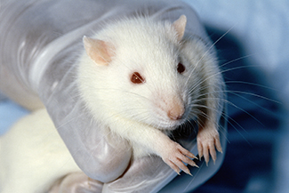

By the end of this section, you will be able to:
* Discuss how research involving human subjects is regulated
* Summarize the processes of informed consent and debriefing
* Explain how research involving animal subjects is regulated

Today, scientists agree that good research is ethical in nature and is guided by a basic respect for human dignity and safety. However, as you will read in the feature box, this has not always been the case. Modern researchers must demonstrate that the research they perform is ethically sound. This section presents how ethical considerations affect the design and implementation of research conducted today.

### RESEARCH INVOLVING HUMAN PARTICIPANTS

Any experiment involving the participation of human subjects is governed by extensive, strict guidelines designed to ensure that the experiment does not result in harm. Any research institution that receives federal support for research involving human participants must have access to an **institutional review board (IRB)**{: data-type="term"}. The IRB is a committee of individuals often made up of members of the institution’s administration, scientists, and community members ([\[link\]](#CNX_Psych_02_06_irb)). The purpose of the IRB is to review proposals for research that involves human participants. The IRB reviews these proposals with the principles mentioned above in mind, and generally, approval from the IRB is required in order for the experiment to proceed.

/Flickr)"){: #CNX_Psych_02_06_irb}

An institution’s IRB requires several components in any experiment it approves. For one, each participant must sign an informed consent form before they can participate in the experiment. An **informed consent**{: data-type="term"} form provides a written description of what participants can expect during the experiment, including potential risks and implications of the research. It also lets participants know that their involvement is completely voluntary and can be discontinued without penalty at any time. Furthermore, the informed consent guarantees that any data collected in the experiment will remain completely confidential. In cases where research participants are under the age of 18, the parents or legal guardians are required to sign the informed consent form.

  
Visit this [website][1] to see an example of a consent form.

While the informed consent form should be as honest as possible in describing exactly what participants will be doing, sometimes deception is necessary to prevent participants’ knowledge of the exact research question from affecting the results of the study. **Deception**{: data-type="term"} involves purposely misleading experiment participants in order to maintain the integrity of the experiment, but not to the point where the deception could be considered harmful. For example, if we are interested in how our opinion of someone is affected by their attire, we might use deception in describing the experiment to prevent that knowledge from affecting participants’ responses. In cases where deception is involved, participants must receive a full **debriefing**{: data-type="term"} upon conclusion of the study—complete, honest information about the purpose of the experiment, how the data collected will be used, the reasons why deception was necessary, and information about how to obtain additional information about the study.

Ethics and the Tuskegee Syphilis Study

Unfortunately, the ethical guidelines that exist for research today were not always applied in the past. In 1932, poor, rural, black, male sharecroppers from Tuskegee, Alabama, were recruited to participate in an experiment conducted by the U.S. Public Health Service, with the aim of studying syphilis in black men ([\[link\]](#CNX_Psych_02_06_tuskegee)). In exchange for free medical care, meals, and burial insurance, 600 men agreed to participate in the study. A little more than half of the men tested positive for syphilis, and they served as the experimental group (given that the researchers could not randomly assign participants to groups, this represents a quasi-experiment). The remaining syphilis-free individuals served as the control group. However, those individuals that tested positive for syphilis were never informed that they had the disease.

While there was no treatment for syphilis when the study began, by 1947 penicillin was recognized as an effective treatment for the disease. Despite this, no penicillin was administered to the participants in this study, and the participants were not allowed to seek treatment at any other facilities if they continued in the study. Over the course of 40 years, many of the participants unknowingly spread syphilis to their wives (and subsequently their children born from their wives) and eventually died because they never received treatment for the disease. This study was discontinued in 1972 when the experiment was discovered by the national press (Tuskegee University, n.d.). The resulting outrage over the experiment led directly to the National Research Act of 1974 and the strict ethical guidelines for research on humans described in this chapter. Why is this study unethical? How were the men who participated and their families harmed as a function of this research?

{: #CNX_Psych_02_06_tuskegee}

  
Visit this [website][2] to learn more about the Tuskegee Syphilis Study.

### RESEARCH INVOLVING ANIMAL SUBJECTS

Many psychologists conduct research involving animal subjects. Often, these researchers use rodents ([\[link\]](#CNX_Psych_02_06_rat)) or birds as the subjects of their experiments—the APA estimates that 90% of all **animal research**{: data-type="term" .no-emphasis} in psychology uses these species (American Psychological Association, n.d.). Because many basic processes in animals are sufficiently similar to those in humans, these animals are acceptable substitutes for research that would be considered unethical in human participants.

 {: #CNX_Psych_02_06_rat}

This does not mean that animal researchers are immune to ethical concerns. Indeed, the humane and ethical treatment of animal research subjects is a critical aspect of this type of research. Researchers must design their experiments to minimize any pain or distress experienced by animals serving as research subjects.

Whereas IRBs review research proposals that involve human participants, animal experimental proposals are reviewed by an **Institutional Animal Care and Use Committee (IACUC)**{: data-type="term"}. An IACUC consists of institutional administrators, scientists, veterinarians, and community members. This committee is charged with ensuring that all experimental proposals require the humane treatment of animal research subjects. It also conducts semi-annual inspections of all animal facilities to ensure that the research protocols are being followed. No animal research project can proceed without the committee’s approval.

### Summary

Ethics in research is an evolving field, and some practices that were accepted or tolerated in the past would be considered unethical today. Researchers are expected to adhere to basic ethical guidelines when conducting experiments that involve human participants. Any experiment involving human participants must be approved by an IRB. Participation in experiments is voluntary and requires informed consent of the participants. If any deception is involved in the experiment, each participant must be fully debriefed upon the conclusion of the study.

Animal research is also held to a high ethical standard. Researchers who use animals as experimental subjects must design their projects so that pain and distress are minimized. Animal research requires the approval of an IACUC, and all animal facilities are subject to regular inspections to ensure that animals are being treated humanely.

### Review Questions

\_\_\_\_\_\_\_\_ is to animal research as \_\_\_\_\_\_\_\_ is to human research.

1.  informed consent; deception
2.  IACUC; IRB
3.  IRB; IACUC
4.  deception; debriefing
{: type="a"}

B

Researchers might use \_\_\_\_\_\_\_\_ when providing participants with the full details of the experiment could skew their responses.

1.  informed consent
2.  deception
3.  ethics
4.  debriefing
{: type="a"}

B

A person’s participation in a research project must be \_\_\_\_\_\_\_\_.

1.  random
2.  rewarded
3.  voluntary
4.  public
{: type="a"}

C

Before participating in an experiment, individuals should read and sign the \_\_\_\_\_\_\_\_ form.

1.  informed consent
2.  debriefing
3.  IRB
4.  ethics
{: type="a"}

A

### Critical Thinking Questions

Some argue that animal research is inherently flawed in terms of being ethical because unlike human participants, animals do not consent to be involved in research. Do you agree with this perspective? Given that animals do not consent to be involved in research projects, what sorts of extra precautions should be taken to ensure that they receive the most humane treatment possible?

In general, the fact that consent cannot be obtained from animal research subjects places extra responsibility on the researcher to ensure that the animal is treated as humanely as possible and to respect the sacrifice that the animal is making for the advancement of science. Like human research, the animals themselves should also receive some of the benefits of the research, and they do in the form of advanced veterinary medicine, and so on.

At the end of the last section, you were asked to design a basic experiment to answer some question of interest. What ethical considerations should be made with the study you proposed to ensure that your experiment would conform to the scientific community’s expectations of ethical research?

The research should be designed in such a way to adhere to the principles described in this section depending on the type of study that was proposed.

### Personal Application Questions

Take a few minutes to think about all of the advancements that our society has achieved as a function of research involving animal subjects. How have you, a friend, or a family member benefited directly from this kind of research?

### Glossary
{: data-type="glossary-title"}

debriefing
: when an experiment involved deception, participants are told complete and truthful information about the experiment at its conclusion
^

deception
: purposely misleading experiment participants in order to maintain the integrity of the experiment
^

informed consent
: process of informing a research participant about what to expect during an experiment, any risks involved, and the implications of the research, and then obtaining the person’s consent to participate
^

Institutional Animal Care and Use Committee (IACUC)
: committee of administrators, scientists, veterinarians, and community members that reviews proposals for research involving non-human animals
^

Institutional Review Board (IRB)
: committee of administrators, scientists, and community members that reviews proposals for research involving human participants

[1]: http://openstaxcollege.org/l/consentform
[2]: https://www.cdc.gov/tuskegee/timeline.htm
