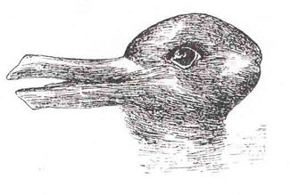
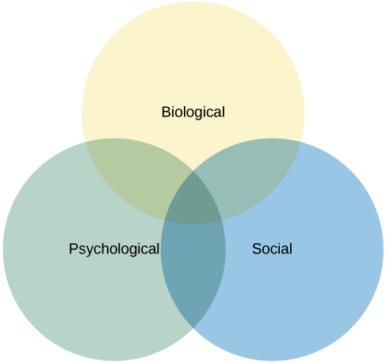

By the end of this section, you will be able to:
* Appreciate the diversity of interests and foci within psychology
* Understand basic interests and applications in each of the described areas of psychology
* Demonstrate familiarity with some of the major concepts or important figures in each of the described areas of psychology

Contemporary psychology is a diverse field that is influenced by all of the historical perspectives described in the preceding section. Reflective of the discipline’s diversity is the diversity seen within the **American Psychological Association (APA)**{: data-type="term"}. The APA is a professional organization representing psychologists in the United States. The APA is the largest organization of psychologists in the world, and its mission is to advance and disseminate psychological knowledge for the betterment of people. There are 56 divisions within the APA, representing a wide variety of specialties that range from Societies for the Psychology of Religion and Spirituality to Exercise and Sport Psychology to Behavioral Neuroscience and Comparative Psychology. Reflecting the diversity of the field of psychology itself, members, affiliate members, and associate members span the spectrum from students to doctoral-level psychologists, and come from a variety of places including educational settings, criminal justice, hospitals, the armed forces, and industry (American Psychological Association, 2014). The Association for Psychological Science (APS) was founded in 1988 and seeks to advance the scientific orientation of psychology. Its founding resulted from disagreements between members of the scientific and clinical branches of psychology within the APA. The APS publishes five research journals and engages in education and advocacy with funding agencies. A significant proportion of its members are international, although the majority is located in the United States. Other organizations provide networking and collaboration opportunities for professionals of several ethnic or racial groups working in psychology, such as the National Latina/o Psychological Association (NLPA), the Asian American Psychological Association (AAPA), the Association of Black Psychologists (ABPsi), and the Society of Indian Psychologists (SIP). Most of these groups are also dedicated to studying psychological and social issues within their specific communities.

This section will provide an overview of the major subdivisions within psychology today in the order in which they are introduced throughout the remainder of this textbook. This is not meant to be an exhaustive listing, but it will provide insight into the major areas of research and practice of modern-day psychologists.

Please visit this [website][1] to learn about the divisions within the APA.

Student [resources][2] are also provided by the APA.

### BIOPSYCHOLOGY AND EVOLUTIONARY PSYCHOLOGY

As the name suggests, **biopsychology**{: data-type="term"} explores how our biology influences our behavior. While biological psychology is a broad field, many biological psychologists want to understand how the structure and function of the nervous system is related to behavior ([\[link\]](#CNX_Psych_01_03_NervSystem)). As such, they often combine the research strategies of both psychologists and physiologists to accomplish this goal (as discussed in Carlson, 2013).

 {: #CNX_Psych_01_03_NervSystem}

The research interests of biological psychologists span a number of domains, including but not limited to, sensory and motor systems, sleep, drug use and abuse, ingestive behavior, reproductive behavior, neurodevelopment, plasticity of the nervous system, and biological correlates of psychological disorders. Given the broad areas of interest falling under the purview of biological psychology, it will probably come as no surprise that individuals from all sorts of backgrounds are involved in this research, including biologists, medical professionals, physiologists, and chemists. This interdisciplinary approach is often referred to as neuroscience, of which biological psychology is a component (Carlson, 2013).

While biopsychology typically focuses on the immediate causes of behavior based in the physiology of a human or other animal, evolutionary psychology seeks to study the ultimate biological causes of behavior. To the extent that a behavior is impacted by genetics, a behavior, like any anatomical characteristic of a human or animal, will demonstrate adaption to its surroundings. These surroundings include the physical environment and, since interactions between organisms can be important to survival and reproduction, the social environment. The study of behavior in the context of evolution has its origins with Charles Darwin, the co-discoverer of the theory of evolution by natural selection. Darwin was well aware that behaviors should be adaptive and wrote books titled, *The Descent of Man* (1871) and *The Expression of the Emotions in Man and Animals* (1872), to explore this field.

Evolutionary psychology, and specifically, the **evolutionary psychology**{: data-type="term" .no-emphasis} of humans, has enjoyed a resurgence in recent decades. To be subject to evolution by natural selection, a behavior must have a significant genetic cause. In general, we expect all human cultures to express a behavior if it is caused genetically, since the genetic differences among human groups are small. The approach taken by most evolutionary psychologists is to predict the outcome of a behavior in a particular situation based on evolutionary theory and then to make observations, or conduct experiments, to determine whether the results match the theory. It is important to recognize that these types of studies are not strong evidence that a behavior is adaptive, since they lack information that the behavior is in some part genetic and not entirely cultural (Endler, 1986). Demonstrating that a trait, especially in humans, is naturally selected is extraordinarily difficult; perhaps for this reason, some evolutionary psychologists are content to assume the behaviors they study have genetic determinants (Confer et al., 2010).

One other drawback of evolutionary psychology is that the traits that we possess now evolved under environmental and social conditions far back in human history, and we have a poor understanding of what these conditions were. This makes predictions about what is adaptive for a behavior difficult. Behavioral traits need not be adaptive under current conditions, only under the conditions of the past when they evolved, about which we can only hypothesize.

There are many areas of human behavior for which evolution can make predictions. Examples include memory, mate choice, relationships between kin, friendship and cooperation, parenting, social organization, and status (Confer et al., 2010).

Evolutionary psychologists have had success in finding experimental correspondence between observations and expectations. In one example, in a study of mate preference differences between men and women that spanned 37 cultures, Buss (1989) found that women valued earning potential factors greater than men, and men valued potential reproductive factors (youth and attractiveness) greater than women in their prospective mates. In general, the predictions were in line with the predictions of evolution, although there were deviations in some cultures.

### SENSATION AND PERCEPTION

Scientists interested in both physiological aspects of sensory systems as well as in the psychological experience of sensory information work within the area of **sensation**{: data-type="term" .no-emphasis} and **perception**{: data-type="term" .no-emphasis} ([\[link\]](#CNX_Psych_01_03_DuckRabbit)). As such, sensation and perception research is also quite interdisciplinary. Imagine walking between buildings as you move from one class to another. You are inundated with sights, sounds, touch sensations, and smells. You also experience the temperature of the air around you and maintain your balance as you make your way. These are all factors of interest to someone working in the domain of sensation and perception.

 {: #CNX_Psych_01_03_DuckRabbit}

As described in a later chapter that focuses on the results of studies in sensation and perception, our experience of our world is not as simple as the sum total of all of the sensory information (or sensations) together. Rather, our experience (or perception) is complex and is influenced by where we focus our attention, our previous experiences, and even our cultural backgrounds.

### COGNITIVE PSYCHOLOGY

As mentioned in the previous section, the cognitive revolution created an impetus for psychologists to focus their attention on better understanding the mind and mental processes that underlie behavior. Thus, **cognitive psychology**{: data-type="term"} is the area of psychology that focuses on studying cognitions, or thoughts, and their relationship to our experiences and our actions. Like biological psychology, cognitive psychology is broad in its scope and often involves collaborations among people from a diverse range of disciplinary backgrounds. This has led some to coin the term cognitive science to describe the interdisciplinary nature of this area of research (Miller, 2003).

Cognitive psychologists have research interests that span a spectrum of topics, ranging from attention to problem solving to language to memory. The approaches used in studying these topics are equally diverse. Given such diversity, cognitive psychology is not captured in one chapter of this text per se; rather, various concepts related to cognitive psychology will be covered in relevant portions of the chapters in this text on sensation and perception, thinking and intelligence, memory, lifespan development, social psychology, and therapy.

View a [brief video][3] recapping some of the major concepts explored by cognitive psychologists.

### DEVELOPMENTAL PSYCHOLOGY

**Developmental psychology**{: data-type="term"} is the scientific study of development across a lifespan. Developmental psychologists are interested in processes related to physical maturation. However, their focus is not limited to the physical changes associated with aging, as they also focus on changes in cognitive skills, moral reasoning, social behavior, and other psychological attributes.

Early developmental psychologists focused primarily on changes that occurred through reaching adulthood, providing enormous insight into the differences in physical, cognitive, and social capacities that exist between very young children and adults. For instance, research by Jean **Piaget**{: data-type="term" .no-emphasis} ([\[link\]](#CNX_Psych_01_03_Piaget)) demonstrated that very young children do not demonstrate object permanence. Object permanence refers to the understanding that physical things continue to exist, even if they are hidden from us. If you were to show an adult a toy, and then hide it behind a curtain, the adult knows that the toy still exists. However, very young infants act as if a hidden object no longer exists. The age at which object permanence is achieved is somewhat controversial (Munakata, McClelland, Johnson, and Siegler, 1997).

 {: #CNX_Psych_01_03_Piaget}

While Piaget was focused on cognitive changes during infancy and childhood as we move to adulthood, there is an increasing interest in extending research into the changes that occur much later in life. This may be reflective of changing population demographics of developed nations as a whole. As more and more people live longer lives, the number of people of advanced age will continue to increase. Indeed, it is estimated that there were just over 40 million people aged 65 or older living in the United States in 2010. However, by 2020, this number is expected to increase to about 55 million. By the year 2050, it is estimated that nearly 90 million people in this country will be 65 or older (Department of Health and Human Services, n.d.).

### PERSONALITY PSYCHOLOGY

**Personality psychology**{: data-type="term"} focuses on patterns of thoughts and behaviors that make each individual unique. Several individuals (e.g., Freud and Maslow) that we have already discussed in our historical overview of psychology, and the American psychologist Gordon Allport, contributed to early theories of personality. These early theorists attempted to explain how an individual’s personality develops from his or her given perspective. For example, Freud proposed that personality arose as conflicts between the conscious and unconscious parts of the mind were carried out over the lifespan. Specifically, Freud theorized that an individual went through various psychosexual stages of development. According to Freud, adult personality would result from the resolution of various conflicts that centered on the migration of erogenous (or sexual pleasure-producing) zones from the oral (mouth) to the anus to the phallus to the genitals. Like many of Freud’s theories, this particular idea was controversial and did not lend itself to experimental tests (Person, 1980).

More recently, the study of personality has taken on a more quantitative approach. Rather than explaining how personality arises, research is focused on identifying **personality traits**{: data-type="term"}, measuring these traits, and determining how these traits interact in a particular context to determine how a person will behave in any given situation. Personality traits are relatively consistent patterns of thought and behavior, and many have proposed that five trait dimensions are sufficient to capture the variations in personality seen across individuals. These five dimensions are known as the “Big Five” or the **Five Factor model**{: data-type="term" .no-emphasis}, and include dimensions of conscientiousness, agreeableness, neuroticism, openness, and extraversion ([\[link\]](#CNX_Psych_01_03_BigFive)). Each of these traits has been demonstrated to be relatively stable over the lifespan (e.g., Rantanen, Metsäpelto, Feldt, Pulkinnen, and Kokko, 2007; Soldz &amp; Vaillant, 1999; McCrae &amp; Costa, 2008) and is influenced by genetics (e.g., Jang, Livesly, and Vernon, 1996).

 ![A diagram includes five vertically stacked arrows, which point to the left and right. A dimension\'s first letter, name, and description are included inside of each arrow. A box to the left of each arrow includes traits associated with a low score for that arrow\'s dimension. A box to the right of each arrow includes traits associated with a high score for that arrow\'s dimension. The top arrow includes the trait &#x201C;openness,&#x201D; which is described with the words, &#x201C;imagination,&#x201D; &#x201C;feelings,&#x201D; &#x201C;actions,&#x201D; and &#x201C;ideas.&#x201D; The box to the left of that arrow includes the words, &#x201C;practical,&#x201D; &#x201C;conventional,&#x201D; and &#x201C;prefers routine,&#x201D; while the box to the right of that arrow includes the words, &#x201C;curious,&#x201D; &#x201C;wide range of interests,&#x201D; and &#x201C;independent.&#x201D; The next arrow includes the trait &#x201C;conscientiousness,&#x201D; which is described with the words, &#x201C;competence,&#x201D; &#x201C;self-discipline,&#x201D; &#x201C;thoughtfulness,&#x201D; and &#x201C;goal-driven.&#x201D; The box to the left of that arrow includes the words, &#x201C;impulsive,&#x201D; &#x201C;careless,&#x201D; and &#x201C;disorganized,&#x201D; while the box to the right of that arrow includes the words, &#x201C;hardworking,&#x201D; &#x201C;dependable,&#x201D; and &#x201C;organized.&#x201D; The next arrow includes the trait &#x201C;extroversion,&#x201D; which is described with the words, &#x201C;sociability,&#x201D; &#x201C;assertiveness,&#x201D; and &#x201C;emotional expression.&#x201D; The box to the left of that arrow includes the words, &#x201C;quiet,&#x201D; &#x201C;reserved,&#x201D; and &#x201C;withdrawn,&#x201D; while the box to the right of that arrow includes the words, &#x201C;outgoing,&#x201D; &#x201C;warm,&#x201D; and &#x201C;seeks adventure.&#x201D; The next arrow includes the trait &#x201C;agreeableness,&#x201D; which is described with the words, &#x201C;cooperative,&#x201D; &#x201C;trustworthy,&#x201D; and &#x201C;good-natured.&#x201D; The box to the left of that arrow includes the words, &#x201C;critical,&#x201D; &#x201C;uncooperative,&#x201D; and &#x201C;suspicious,&#x201D; while the box to the right of that arrow includes the words, &#x201C;helpful,&#x201D; &#x201C;trusting,&#x201D; and &#x201C;empathetic.&#x201D; The next arrow includes the trait &#x201C;neuroticism,&#x201D; which is described as &#x201C;tendency toward unstable emotions.&#x201D; The box to the left of that arrow includes the words, &#x201C;calm,&#x201D; &#x201C;even-tempered,&#x201D; and &#x201C;secure,&#x201D; while the box to the right of that arrow includes the words, &#x201C;anxious,&#x201D; &#x201C;unhappy,&#x201D; and &#x201C;prone to negative emotions.&#x201D;](../resources/CNX_Psych_01_03_BigFive.jpg "Each of the dimensions of the Five Factor model is shown in this figure. The provided description would describe someone who scored highly on that given dimension. Someone with a lower score on a given dimension could be described in opposite terms."){: #CNX_Psych_01_03_BigFive}

### SOCIAL PSYCHOLOGY

**Social psychology**{: data-type="term" .no-emphasis} focuses on how we interact with and relate to others. Social psychologists conduct research on a wide variety of topics that include differences in how we explain our own behavior versus how we explain the behaviors of others, prejudice, and attraction, and how we resolve interpersonal conflicts. Social psychologists have also sought to determine how being among other people changes our own behavior and patterns of thinking.

There are many interesting examples of social psychological research, and you will read about many of these in a later chapter of this textbook. Until then, you will be introduced to one of the most controversial psychological studies ever conducted. Stanley **Milgram**{: data-type="term" .no-emphasis} was an American social psychologist who is most famous for research that he conducted on obedience. After the holocaust, in 1961, a Nazi war criminal, Adolf Eichmann, who was accused of committing mass atrocities, was put on trial. Many people wondered how German soldiers were capable of torturing prisoners in concentration camps, and they were unsatisfied with the excuses given by soldiers that they were simply following orders. At the time, most psychologists agreed that few people would be willing to inflict such extraordinary pain and suffering, simply because they were obeying orders. Milgram decided to conduct research to determine whether or not this was true ([\[link\]](#CNX_Psych_01_03_Milgram)). As you will read later in the text, Milgram found that nearly two-thirds of his participants were willing to deliver what they believed to be lethal shocks to another person, simply because they were instructed to do so by an authority figure (in this case, a man dressed in a lab coat). This was in spite of the fact that participants received payment for simply showing up for the research study and could have chosen not to inflict pain or more serious consequences on another person by withdrawing from the study. No one was actually hurt or harmed in any way, Milgram’s experiment was a clever ruse that took advantage of research confederates, those who pretend to be participants in a research study who are actually working for the researcher and have clear, specific directions on how to behave during the research study (Hock, 2009). Milgram’s and others’ studies that involved deception and potential emotional harm to study participants catalyzed the development of ethical guidelines for conducting psychological research that discourage the use of deception of research subjects, unless it can be argued not to cause harm and, in general, requiring informed consent of participants.

 ![An advertisement reads: &#x201C;Public Announcement. We will pay you $4.00 for one hour of your time. Persons Needed for a Study of Memory. We will pay five hundred New Haven men to help us complete a scientific study of memory and learning. The study is being done at Yale University. Each person who participates will be paid $4.00 (plus 50 cents carfare) for approximately 1 hour&#x2019;s time. We need you for only one hour: there are no further obligations. You may choose the time you would like to come (evenings, weekdays, or weekends). No special training, education, or experience is needed. We want: factory workers, city employees, laborers, barbers, businessmen, clerks, professional people, telephone workers, construction workers, salespeople, white-collar workers, and others. All persons must be between the ages of 20 and 50. High school and college students cannot be used. If you meet these qualifications, fill out the coupon below and mail it now to Professor Stanley Milgram, Department of Psychology, Yale University, New Haven. You will be notified later of the specific time and place of the study. We reserve the right to decline any application. You will be paid $4.00 (plus 50 cents carfare) as soon as you arrive at the laboratory.&#x201D; There is a dotted line and the below section reads: &#x201C;TO: PROF. STANLEY MILGRAM, DEPARTMENT OF PSYCHOLOGY, YALE UNIVERSITY, NEW HAVEN, CONN. I want to take part in this study of memory and learning. I am between the ages of 20 and 50. I will be paid $4.00 (plus 50 cents carfare) if I participate.&#x201D; Below this is a section to be filled out by the applicant. The fields are NAME (Please Print), ADDRESS, TELEPHONE NO. Best time to call you, AGE, OCCUPATION, SEX, CAN YOU COME: WEEKDAYS, EVENINGS, WEEKENDS.](../resources/CNX_Psych_01_03_Milgram.jpg "Stanley Milgram&#x2019;s research demonstrated just how far people will go in obeying orders from an authority figure. This advertisement was used to recruit subjects for his research."){: #CNX_Psych_01_03_Milgram}

### INDUSTRIAL-ORGANIZATIONAL PSYCHOLOGY

**Industrial-Organizational psychology**{: data-type="term" .no-emphasis} (I-O psychology) is a subfield of psychology that applies psychological theories, principles, and research findings in industrial and organizational settings. I-O psychologists are often involved in issues related to personnel management, organizational structure, and workplace environment. Businesses often seek the aid of I-O psychologists to make the best hiring decisions as well as to create an environment that results in high levels of employee productivity and efficiency. In addition to its applied nature, I-O psychology also involves conducting scientific research on behavior within I-O settings (Riggio, 2013).

### HEALTH PSYCHOLOGY

**Health psychology**{: data-type="term" .no-emphasis} focuses on how health is affected by the interaction of biological, psychological, and sociocultural factors. This particular approach is known as the **biopsychosocial model**{: data-type="term"} ([\[link\]](#CNX_Psych_01_03_BioPsych)). Health psychologists are interested in helping individuals achieve better health through public policy, education, intervention, and research. Health psychologists might conduct research that explores the relationship between one’s genetic makeup, patterns of behavior, relationships, psychological stress, and health. They may research effective ways to motivate people to address patterns of behavior that contribute to poorer health (MacDonald, 2013).

 {: #CNX_Psych_01_03_BioPsych}

### SPORT AND EXERCISE PSYCHOLOGY

Researchers in **sport and exercise psychology**{: data-type="term"} study the psychological aspects of sport performance, including motivation and performance anxiety, and the effects of sport on mental and emotional wellbeing. Research is also conducted on similar topics as they relate to physical exercise in general. The discipline also includes topics that are broader than sport and exercise but that are related to interactions between mental and physical performance under demanding conditions, such as fire fighting, military operations, artistic performance, and surgery.

### CLINICAL PSYCHOLOGY

**Clinical psychology**{: data-type="term"} is the area of psychology that focuses on the diagnosis and treatment of psychological disorders and other problematic patterns of behavior. As such, it is generally considered to be a more applied area within psychology; however, some clinicians are also actively engaged in scientific research. **Counseling psychology**{: data-type="term"} is a similar discipline that focuses on emotional, social, vocational, and health-related outcomes in individuals who are considered psychologically healthy.

As mentioned earlier, both Freud and Rogers provided perspectives that have been influential in shaping how clinicians interact with people seeking psychotherapy. While aspects of the psychoanalytic theory are still found among some of today’s therapists who are trained from a psychodynamic perspective, Roger’s ideas about client-centered **therapy**{: data-type="term" .no-emphasis} have been especially influential in shaping how many clinicians operate. Furthermore, both behaviorism and the cognitive revolution have shaped clinical practice in the forms of behavioral therapy, cognitive therapy, and cognitive-behavioral therapy ([\[link\]](#CNX_Psych_01_03_CogBehav)). Issues related to the diagnosis and treatment of psychological disorders and problematic patterns of behavior will be discussed in detail in later chapters of this textbook.

 {: #CNX_Psych_01_03_CogBehav}

By far, this is the area of psychology that receives the most attention in popular media, and many people mistakenly assume that all psychology is clinical psychology.

### FORENSIC PSYCHOLOGY

**Forensic psychology**{: data-type="term"} is a branch of psychology that deals questions of psychology as they arise in the context of the justice system. For example, forensic psychologists (and forensic psychiatrists) will assess a person’s competency to stand trial, assess the state of mind of a defendant, act as consultants on child custody cases, consult on sentencing and treatment recommendations, and advise on issues such as eyewitness testimony and children’s testimony (American Board of Forensic Psychology, 2014). In these capacities, they will typically act as expert witnesses, called by either side in a court case to provide their research- or experience-based opinions. As expert witnesses, forensic psychologists must have a good understanding of the law and provide information in the context of the legal system rather than just within the realm of psychology. Forensic psychologists are also used in the jury selection process and witness preparation. They may also be involved in providing psychological treatment within the criminal justice system. Criminal profilers are a relatively small proportion of psychologists that act as consultants to law enforcement.

The APA provides [career information][4] about various areas of psychology.

### Summary

Psychology is a diverse discipline that is made up of several major subdivisions with unique perspectives. Biological psychology involves the study of the biological bases of behavior. Sensation and perception refer to the area of psychology that is focused on how information from our sensory modalities is received, and how this information is transformed into our perceptual experiences of the world around us. Cognitive psychology is concerned with the relationship that exists between thought and behavior, and developmental psychologists study the physical and cognitive changes that occur throughout one’s lifespan. Personality psychology focuses on individuals’ unique patterns of behavior, thought, and emotion. Industrial and organizational psychology, health psychology, sport and exercise psychology, forensic psychology, and clinical psychology are all considered applied areas of psychology. Industrial and organizational psychologists apply psychological concepts to I-O settings. Health psychologists look for ways to help people live healthier lives, and clinical psychology involves the diagnosis and treatment of psychological disorders and other problematic behavioral patterns. Sport and exercise psychologists study the interactions between thoughts, emotions, and physical performance in sports, exercise, and other activities. Forensic psychologists carry out activities related to psychology in association with the justice system.

### Review Questions

A researcher interested in how changes in the cells of the hippocampus (a structure in the brain related to learning and memory) are related to memory formation would be most likely to identify as a(n) \_\_\_\_\_\_\_\_ psychologist.

1.  biological
2.  health
3.  clinical
4.  social
{: data-number-style="lower-alpha"}

A

An individual’s consistent pattern of thought and behavior is known as a(n) \_\_\_\_\_\_\_\_.

1.  psychosexual stage
2.  object permanence
3.  personality
4.  perception
{: data-number-style="lower-alpha"}

C

In Milgram’s controversial study on obedience, nearly \_\_\_\_\_\_\_\_ of the participants were willing to administer what appeared to be lethal electrical shocks to another person because they were told to do so by an authority figure.

1.  1/3
2.  2/3
3.  3/4
4.  4/5
{: data-number-style="lower-alpha"}

B

A researcher interested in what factors make an employee best suited for a given job would most likely identify as a(n) \_\_\_\_\_\_\_\_ psychologist.

1.  personality
2.  clinical
3.  social
4.  I-O
{: data-number-style="lower-alpha"}

D

### Critical Thinking Questions

Given the incredible diversity among the various areas of psychology that were described in this section, how do they all fit together?

Although the different perspectives all operate on different levels of analyses, have different foci of interests, and different methodological approaches, all of these areas share a focus on understanding and/or correcting patterns of thought and/or behavior.

What are the potential ethical concerns associated with Milgram’s research on obedience?

Many people have questioned how ethical this particular research was. Although no one was actually harmed in Milgram’s study, many people have questioned how the knowledge that you would be willing to inflict incredible pain and/or death to another person, simply because someone in authority told you to do so, would affect someone’s self-concept and psychological health. Furthermore, the degree to which deception was used in this particular study raises a few eyebrows.

### Personal Application Question

Now that you’ve been briefly introduced to some of the major areas within psychology, which are you most interested in learning more about? Why?

### Glossary
{: data-type="glossary-title"}

American Psychological Association
: professional organization representing psychologists in the United States
^

biopsychology
: study of how biology influences behavior
^

biopsychosocial model
: perspective that asserts that biology, psychology, and social factors interact to determine an individual’s health
^

clinical psychology
: area of psychology that focuses on the diagnosis and treatment of psychological disorders and other problematic patterns of behavior
^

cognitive psychology
: study of cognitions, or thoughts, and their relationship to experiences and actions
^

counseling psychology
: area of psychology that focuses on improving emotional, social, vocational, and other aspects of the lives of psychologically healthy individuals
^

developmental psychology
: scientific study of development across a lifespan
^

forensic psychology
: area of psychology that applies the science and practice of psychology to issues within and related to the justice system
^

personality psychology
: study of patterns of thoughts and behaviors that make each individual unique
^

personality trait
: consistent pattern of thought and behavior
^

sport and exercise psychology
: area of psychology that focuses on the interactions between mental and emotional factors and physical performance in sports, exercise, and other activities

[1]: http://openstaxcollege.org/l/biopsychology
[2]: http://openstaxcollege.org/l/studentresource
[3]: http://openstaxcollege.org/l/cogpsys
[4]: http://openstaxcollege.org/l/careers
