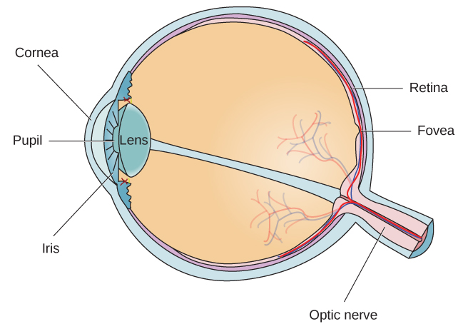
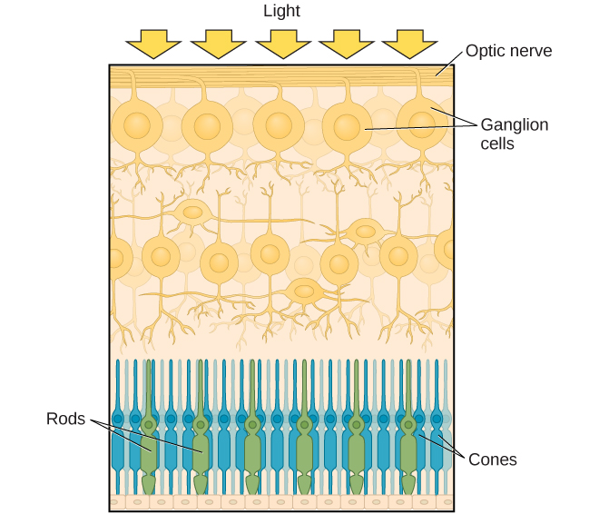
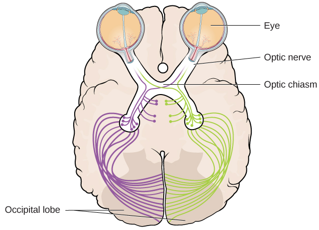

By the end of this section, you will be able to:
* Describe the basic anatomy of the visual system
* Discuss how rods and cones contribute to different aspects of vision
* Describe how monocular and binocular cues are used in the perception of depth

The visual system constructs a mental representation of the world around us ([\[link\]](#Figure_05_03_Eyes)). This contributes to our ability to successfully navigate through physical space and interact with important individuals and objects in our environments. This section will provide an overview of the basic anatomy and function of the visual system. In addition, we will explore our ability to perceive color and depth.

 "){: #Figure_05_03_Eyes}

### ANATOMY OF THE VISUAL SYSTEM 

The eye is the major sensory organ involved in **vision**{: data-type="term" .no-emphasis} ([\[link\]](#Figure_05_03_Eye)). Light waves are transmitted across the cornea and enter the eye through the pupil. The **cornea**{: data-type="term"} is the transparent covering over the eye. It serves as a barrier between the inner eye and the outside world, and it is involved in focusing light waves that enter the eye. The **pupil**{: data-type="term"} is the small opening in the eye through which light passes, and the size of the pupil can change as a function of light levels as well as emotional arousal. When light levels are low, the pupil will become dilated, or expanded, to allow more light to enter the eye. When light levels are high, the pupil will constrict, or become smaller, to reduce the amount of light that enters the eye. The pupil’s size is controlled by muscles that are connected to the **iris**{: data-type="term"}, which is the colored portion of the eye.

 {: #Figure_05_03_Eye}

After passing through the pupil, light crosses the **lens**{: data-type="term"}, a curved, transparent structure that serves to provide additional focus. The lens is attached to muscles that can change its shape to aid in focusing light that is reflected from near or far objects. In a normal-sighted individual, the lens will focus images perfectly on a small indentation in the back of the eye known as the **fovea**{: data-type="term"}, which is part of the **retina**{: data-type="term"}, the light-sensitive lining of the eye. The fovea contains densely packed specialized photoreceptor cells ([\[link\]](#Figure_05_03_RodsCones)). These **photoreceptor**{: data-type="term"} cells, known as cones, are light-detecting cells. The **cones**{: data-type="term"} are specialized types of photoreceptors that work best in bright light conditions. Cones are very sensitive to acute detail and provide tremendous spatial resolution. They also are directly involved in our ability to perceive color.

While cones are concentrated in the fovea, where images tend to be focused, rods, another type of photoreceptor, are located throughout the remainder of the retina. **Rods**{: data-type="term"} are specialized photoreceptors that work well in low light conditions, and while they lack the spatial resolution and color function of the cones, they are involved in our vision in dimly lit environments as well as in our perception of movement on the periphery of our visual field.

 {: #Figure_05_03_RodsCones}

We have all experienced the different sensitivities of rods and cones when making the transition from a brightly lit environment to a dimly lit environment. Imagine going to see a blockbuster movie on a clear summer day. As you walk from the brightly lit lobby into the dark theater, you notice that you immediately have difficulty seeing much of anything. After a few minutes, you begin to adjust to the darkness and can see the interior of the theater. In the bright environment, your vision was dominated primarily by cone activity. As you move to the dark environment, rod activity dominates, but there is a delay in transitioning between the phases. If your rods do not transform light into nerve impulses as easily and efficiently as they should, you will have difficulty seeing in dim light, a condition known as night blindness.

Rods and cones are connected (via several interneurons) to retinal ganglion cells. Axons from the retinal ganglion cells converge and exit through the back of the eye to form the **optic nerve**{: data-type="term"}. The optic nerve carries visual information from the retina to the brain. There is a point in the visual field called the **blind spot**{: data-type="term"}\: Even when light from a small object is focused on the blind spot, we do not see it. We are not consciously aware of our blind spots for two reasons: First, each eye gets a slightly different view of the visual field; therefore, the blind spots do not overlap. Second, our visual system fills in the blind spot so that although we cannot respond to visual information that occurs in that portion of the visual field, we are also not aware that information is missing.

The optic nerve from each eye merges just below the brain at a point called the **optic chiasm**{: data-type="term"}. As [\[link\]](#Figure_05_03_OpticChias) shows, the optic chiasm is an X-shaped structure that sits just below the cerebral cortex at the front of the brain. At the point of the optic chiasm, information from the right visual field (which comes from both eyes) is sent to the left side of the brain, and information from the left visual field is sent to the right side of the brain.

 {: #Figure_05_03_OpticChias}

Once inside the brain, visual information is sent via a number of structures to the occipital lobe at the back of the brain for processing. Visual information might be processed in parallel pathways which can generally be described as the “what pathway” and the “where/how” pathway. The “what pathway” is involved in object recognition and identification, while the “where/how pathway” is involved with location in space and how one might interact with a particular visual stimulus (Milner &amp; Goodale, 2008; Ungerleider &amp; Haxby, 1994). For example, when you see a ball rolling down the street, the “what pathway” identifies what the object is, and the “where/how pathway” identifies its location or movement in space.

### COLOR AND DEPTH PERCEPTION

We do not see the world in black and white; neither do we see it as two-dimensional (2-D) or flat (just height and width, no depth). Let’s look at how color vision works and how we perceive three dimensions (height, width, and depth).

#### Color Vision

Normal-sighted individuals have three different types of cones that mediate **color vision**{: data-type="term" .no-emphasis}. Each of these cone types is maximally sensitive to a slightly different wavelength of light. According to the **trichromatic theory of color vision**{: data-type="term"}, shown in [\[link\]](#Figure_05_03_Trichrom), all colors in the spectrum can be produced by combining red, green, and blue. The three types of cones are each receptive to one of the colors.

 ![A graph is shown with &#x201C;sensitivity&#x201D; plotted on the y-axis and &#x201C;Wavelength&#x201D; in nanometers plotted along the x-axis with measurements of 400, 500, 600, and 700. Three lines in different colors move from the base to the peak of the y axis, and back to the base. The blue line begins at 400 nm and hits its peak of sensitivity around 455 nanometers, before the sensitivity drops off at roughly the same rate at which it increased, returning to the lowest sensitivity around 530 nm . The green line begins at 400 nm and reaches its peak of sensitivity around 535 nanometers. Its sensitivity then decreases at roughly the same rate at which it increased, returning to the lowest sensitivity around 650 nm. The red line follows the same pattern as the first two, beginning at 400 nm, increasing and decreasing at the same rate, and it hits its height of sensitivity around 580 nanometers. Below this graph is a horizontal bar showing the colors of the visible spectrum.](../resources/CNX_Psych_05_03_Trichrom.jpg "This figure illustrates the different sensitivities for the three cone types found in a normal-sighted individual. (credit: modification of work by Vanessa Ezekowitz)"){: #Figure_05_03_Trichrom}

The trichromatic theory of color vision is not the only theory—another major theory of color vision is known as the **opponent-process theory**{: data-type="term"}. According to this theory, color is coded in opponent pairs: black-white, yellow-blue, and green-red. The basic idea is that some cells of the visual system are excited by one of the opponent colors and inhibited by the other. So, a cell that was excited by wavelengths associated with green would be inhibited by wavelengths associated with red, and vice versa. One of the implications of opponent processing is that we do not experience greenish-reds or yellowish-blues as colors. Another implication is that this leads to the experience of negative afterimages. An **afterimage**{: data-type="term"} describes the continuation of a visual sensation after removal of the stimulus. For example, when you stare briefly at the sun and then look away from it, you may still perceive a spot of light although the stimulus (the sun) has been removed. When color is involved in the stimulus, the color pairings identified in the opponent-process theory lead to a negative afterimage. You can test this concept using the flag in [\[link\]](#Figure_05_03_Afterimage).

 {: #Figure_05_03_Afterimage}

But these two theories—the trichromatic theory of color vision and the opponent-process theory—are not mutually exclusive. Research has shown that they just apply to different levels of the nervous system. For visual processing on the retina, trichromatic theory applies: the cones are responsive to three different wavelengths that represent red, blue, and green. But once the signal moves past the retina on its way to the brain, the cells respond in a way consistent with opponent-process theory (Land, 1959; Kaiser, 1997).

Watch this [video][1] to see the first part of a documentary explaining color vision in more detail.

#### Depth Perception

Our ability to perceive spatial relationships in three-dimensional (3-D) space is known as **depth perception**{: data-type="term"}. With depth perception, we can describe things as being in front, behind, above, below, or to the side of other things.

Our world is three-dimensional, so it makes sense that our mental representation of the world has three-dimensional properties. We use a variety of cues in a visual scene to establish our sense of depth. Some of these are **binocular**{: data-type="term"} **cues**{: data-type="term"}, which means that they rely on the use of both eyes. One example of a binocular depth cue is **binocular disparity**{: data-type="term"}, the slightly different view of the world that each of our eyes receives. To experience this slightly different view, do this simple exercise: extend your arm fully and extend one of your fingers and focus on that finger. Now, close your left eye without moving your head, then open your left eye and close your right eye without moving your head. You will notice that your finger seems to shift as you alternate between the two eyes because of the slightly different view each eye has of your finger.

A 3-D movie works on the same principle: the special glasses you wear allow the two slightly different images projected onto the screen to be seen separately by your left and your right eye. As your brain processes these images, you have the illusion that the leaping animal or running person is coming right toward you.

Although we rely on binocular cues to experience depth in our 3-D world, we can also perceive depth in 2-D arrays. Think about all the paintings and photographs you have seen. Generally, you pick up on depth in these images even though the visual stimulus is 2-D. When we do this, we are relying on a number of **monocular cues**{: data-type="term"}, or cues that require only one eye. If you think you can’t see depth with one eye, note that you don’t bump into things when using only one eye while walking—and, in fact, we have more monocular cues than binocular cues.

An example of a monocular cue would be what is known as linear perspective. **Linear perspective**{: data-type="term"} refers to the fact that we perceive depth when we see two parallel lines that seem to converge in an image ([\[link\]](#Figure_05_03_LinPerspec)). Some other monocular depth cues are interposition, the partial overlap of objects, and the relative size and closeness of images to the horizon.

 "){: #Figure_05_03_LinPerspec}

Stereoblindness

Bruce Bridgeman was born with an extreme case of lazy eye that resulted in him being stereoblind, or unable to respond to binocular cues of depth. He relied heavily on monocular depth cues, but he never had a true appreciation of the 3-D nature of the world around him. This all changed one night in 2012 while Bruce was seeing a movie with his wife.

The movie the couple was going to see was shot in 3-D, and even though he thought it was a waste of money, Bruce paid for the 3-D glasses when he purchased his ticket. As soon as the film began, Bruce put on the glasses and experienced something completely new. For the first time in his life he appreciated the true depth of the world around him. Remarkably, his ability to perceive depth persisted outside of the movie theater.

There are cells in the nervous system that respond to binocular depth cues. Normally, these cells require activation during early development in order to persist, so experts familiar with Bruce’s case (and others like his) assume that at some point in his development, Bruce must have experienced at least a fleeting moment of binocular vision. It was enough to ensure the survival of the cells in the visual system tuned to binocular cues. The mystery now is why it took Bruce nearly 70 years to have these cells activated (Peck, 2012).

#### Summary

Light waves cross the cornea and enter the eye at the pupil. The eye’s lens focuses this light so that the image is focused on a region of the retina known as the fovea. The fovea contains cones that possess high levels of visual acuity and operate best in bright light conditions. Rods are located throughout the retina and operate best under dim light conditions. Visual information leaves the eye via the optic nerve. Information from each visual field is sent to the opposite side of the brain at the optic chiasm. Visual information then moves through a number of brain sites before reaching the occipital lobe, where it is processed.

Two theories explain color perception. The trichromatic theory asserts that three distinct cone groups are tuned to slightly different wavelengths of light, and it is the combination of activity across these cone types that results in our perception of all the colors we see. The opponent-process theory of color vision asserts that color is processed in opponent pairs and accounts for the interesting phenomenon of a negative afterimage. We perceive depth through a combination of monocular and binocular depth cues.

### Review Questions

The \_\_\_\_\_\_\_\_ is a small indentation of the retina that contains cones.

1.  optic chiasm
2.  optic nerve
3.  fovea
4.  iris
{: data-number-style="lower-alpha"}

C

\_\_\_\_\_\_\_\_ operate best under bright light conditions.

1.  cones
2.  rods
3.  retinal ganglion cells
4.  striate cortex
{: data-number-style="lower-alpha"}

A

\_\_\_\_\_\_\_\_ depth cues require the use of both eyes.

1.  monocular
2.  binocular
3.  linear perspective
4.  accommodating
{: data-number-style="lower-alpha"}

B

If you were to stare at a green dot for a relatively long period of time and then shift your gaze to a blank white screen, you would see a \_\_\_\_\_\_\_\_ negative afterimage.

1.  blue
2.  yellow
3.  black
4.  red
{: data-number-style="lower-alpha"}

D

### Critical Thinking Question

Compare the two theories of color perception. Are they completely different?

The trichromatic theory of color vision and the opponent-process theory are not mutually exclusive. Research has shown they apply to different levels of the nervous system. For visual processing on the retina, trichromatic theory applies: the cones are responsive to three different wavelengths that represent red, blue, and green. But once the signal moves past the retina on its way to the brain, the cells respond in a way consistent with opponent-process theory.

Color is not a physical property of our environment. What function (if any) do you think color vision serves?

Color vision probably serves multiple adaptive purposes. One popular hypothesis suggests that seeing in color allowed our ancestors to differentiate ripened fruits and vegetables more easily.

### Personal Application Question

Take a look at a few of your photos or personal works of art. Can you find examples of linear perspective as a potential depth cue?

### Glossary
{: data-type="glossary-title"}

afterimage
: continuation of a visual sensation after removal of the stimulus
^

binocular cue
: cue that relies on the use of both eyes
^

binocular disparity
: slightly different view of the world that each eye receives
^

blind spot
: point where we cannot respond to visual information in that portion of the visual field
^

cone
: specialized photoreceptor that works best in bright light conditions and detects color
^

cornea
: transparent covering over the eye
^

depth perception
: ability to perceive depth
^

fovea
: small indentation in the retina that contains cones
^

iris
: colored portion of the eye
^

lens
: curved, transparent structure that provides additional focus for light entering the eye
^

linear perspective
: perceive depth in an image when two parallel lines seem to converge
^

monocular cue
: cue that requires only one eye
^

opponent-process theory of color perception
: color is coded in opponent pairs: black-white, yellow-blue, and red-green
^

optic chiasm
: X-shaped structure that sits just below the brain’s ventral surface; represents the merging of the optic nerves from the two eyes and the separation of information from the two sides of the visual field to the opposite side of the brain
^

optic nerve
: carries visual information from the retina to the brain
^

photoreceptor
: light-detecting cell
^

pupil
: small opening in the eye through which light passes
^

retina
: light-sensitive lining of the eye
^

rod
: specialized photoreceptor that works well in low light conditions
^

trichromatic theory of color perception
: color vision is mediated by the activity across the three groups of cones

[1]: http://openstaxcollege.org/l/colorvision
