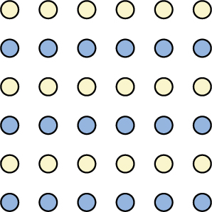

By the end of this section, you will be able to:
* Explain the figure-ground relationship
* Define Gestalt principles of grouping
* Describe how perceptual set is influenced by an individual’s characteristics and mental state

In the early part of the 20th century, Max Wertheimer published a paper demonstrating that individuals perceived motion in rapidly flickering static images—an insight that came to him as he used a child’s toy tachistoscope. Wertheimer, and his assistants Wolfgang Köhler and Kurt Koffka, who later became his partners, believed that perception involved more than simply combining sensory stimuli. This belief led to a new movement within the field of psychology known as **Gestalt psychology**{: data-type="term"}. The word <em>gestalt </em>literally means form or pattern, but its use reflects the idea that the whole is different from the sum of its parts. In other words, the brain creates a perception that is more than simply the sum of available sensory inputs, and it does so in predictable ways. Gestalt psychologists translated these predictable ways into principles by which we organize sensory information. As a result, Gestalt psychology has been extremely influential in the area of sensation and perception (Rock &amp; Palmer, 1990).

One Gestalt principle is the **figure-ground relationship**{: data-type="term"}. According to this principle, we tend to segment our visual world into figure and ground. Figure is the object or person that is the focus of the visual field, while the ground is the background. As [\[link\]](#Figure_05_06_FacesVase) shows, our perception can vary tremendously, depending on what is perceived as figure and what is perceived as ground. Presumably, our ability to interpret sensory information depends on what we label as figure and what we label as ground in any particular case, although this assumption has been called into question (Peterson &amp; Gibson, 1994; Vecera &amp; O’Reilly, 1998).

 {: #Figure_05_06_FacesVase}

Another Gestalt principle for organizing sensory stimuli into meaningful perception is **proximity**{: data-type="term"}. This principle asserts that things that are close to one another tend to be grouped together, as [\[link\]](#Figure_05_06_Proximity) illustrates.

  one block of dots on the left side and (b) three columns on the right side."){: #Figure_05_06_Proximity}

How we read something provides another illustration of the proximity concept. For example, we read this sentence like this, notl iket hiso rt hat. We group the letters of a given word together because there are no spaces between the letters, and we perceive words because there are spaces between each word. Here are some more examples: Cany oum akes enseo ft hiss entence? What doth es e wor dsmea n?

We might also use the principle of **similarity**{: data-type="term"} to group things in our visual fields. According to this principle, things that are alike tend to be grouped together ([\[link\]](#Figure_05_06_Similarity)). For example, when watching a football game, we tend to group individuals based on the colors of their uniforms. When watching an offensive drive, we can get a sense of the two teams simply by grouping along this dimension.

 {: #Figure_05_06_Similarity}

Two additional Gestalt principles are the law of <strong data-type="term">continuity </strong>(or **good continuation**{: data-type="term"}) and **closure**{: data-type="term"}. The law of continuity suggests that we are more likely to perceive continuous, smooth flowing lines rather than jagged, broken lines ([\[link\]](#Figure_05_06_Continuity)). The **principle of closure**{: data-type="term"} states that we organize our perceptions into complete objects rather than as a series of parts ([\[link\]](#Figure_05_06_Closure)).

 {: #Figure_05_06_Continuity}

{: #Figure_05_06_Closure}

  
Watch this [video][1] showing real world illustrations of Gestalt principles.

According to Gestalt theorists, **pattern perception**{: data-type="term"}, or our ability to discriminate among different figures and shapes, occurs by following the principles described above. You probably feel fairly certain that your perception accurately matches the real world, but this is not always the case. Our perceptions are based on **perceptual hypotheses**{: data-type="term"}\: educated guesses that we make while interpreting sensory information. These hypotheses are informed by a number of factors, including our personalities, experiences, and expectations. We use these hypotheses to generate our perceptual set. For instance, research has demonstrated that those who are given verbal priming produce a biased interpretation of complex ambiguous figures (Goolkasian &amp; Woodbury, 2010).

The Depths of Perception: Bias, Prejudice, and Cultural Factors

In this chapter, you have learned that perception is a complex process. Built from sensations, but influenced by our own experiences, biases, prejudices, and **cultures**{: data-type="term" .no-emphasis}, perceptions can be very different from person to person. Research suggests that implicit racial **prejudice**{: data-type="term" .no-emphasis} and **stereotypes**{: data-type="term" .no-emphasis} affect perception. For instance, several studies have demonstrated that non-Black participants identify weapons faster and are more likely to identify non-weapons as weapons when the image of the weapon is paired with the image of a Black person (Payne, 2001; Payne, Shimizu, &amp; Jacoby, 2005). Furthermore, White individuals’ decisions to shoot an armed target in a video game is made more quickly when the target is Black (Correll, Park, Judd, &amp; Wittenbrink, 2002; Correll, Urland, &amp; Ito, 2006). This research is important, considering the number of very high-profile cases in the last few decades in which young Blacks were killed by people who claimed to believe that the unarmed individuals were armed and/or represented some threat to their personal safety.

### Summary

Gestalt theorists have been incredibly influential in the areas of sensation and perception. Gestalt principles such as figure-ground relationship, grouping by proximity or similarity, the law of good continuation, and closure are all used to help explain how we organize sensory information. Our perceptions are not infallible, and they can be influenced by bias, prejudice, and other factors.

### Review Questions

According to the principle of \_\_\_\_\_\_\_\_, objects that occur close to one another tend to be grouped together.

1.  similarity
2.  good continuation
3.  proximity
4.  closure
{: type="a"}

C

Our tendency to perceive things as complete objects rather than as a series of parts is known as the principle of \_\_\_\_\_\_\_\_.

1.  closure
2.  good continuation
3.  proximity
4.  similarity
{: type="a"}

A

According to the law of \_\_\_\_\_\_\_\_, we are more likely to perceive smoothly flowing lines rather than choppy or jagged lines.

1.  closure
2.  good continuation
3.  proximity
4.  similarity
{: type="a"}

B

The main point of focus in a visual display is known as the \_\_\_\_\_\_\_\_.

1.  closure
2.  perceptual set
3.  ground
4.  figure
{: type="a"}

D

### Critical Thinking Question

The central tenet of Gestalt psychology is that the whole is different from the sum of its parts. What does this mean in the context of perception?

This means that perception cannot be understood completely simply by combining the parts. Rather, the relationship that exists among those parts (which would be established according to the principles described in this chapter) is important in organizing and interpreting sensory information into a perceptual set.

Take a look at the following figure. How might you influence whether people see a duck or a rabbit?

{: #Figure_05_06_DuckRabbit}

Playing on their expectations could be used to influence what they were most likely to see. For instance, telling a story about Peter Rabbit and then presenting this image would bias perception along rabbit lines.

### Personal Application Question

Have you ever listened to a song on the radio and sung along only to find out later that you have been singing the wrong lyrics? Once you found the correct lyrics, did your perception of the song change?

### Glossary
{: data-type="glossary-title"}

closure
: organizing our perceptions into complete objects rather than as a series of parts
^

figure-ground relationship
: segmenting our visual world into figure and ground
^

Gestalt psychology
: field of psychology based on the idea that the whole is different from the sum of its parts
^

good continuation
: (also, continuity) we are more likely to perceive continuous, smooth flowing lines rather than jagged, broken lines
^

pattern perception
: ability to discriminate among different figures and shapes
^

perceptual hypothesis
: educated guess used to interpret sensory information
^

principle of closure
: organize perceptions into complete objects rather than as a series of parts
^

proximity
: things that are close to one another tend to be grouped together
^

similarity
: things that are alike tend to be grouped together

[1]: http://openstaxcollege.org/l/gestalt
